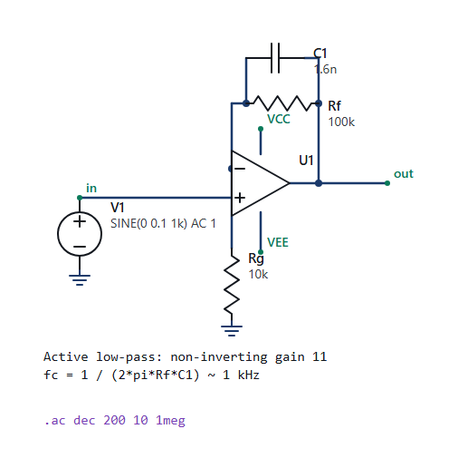
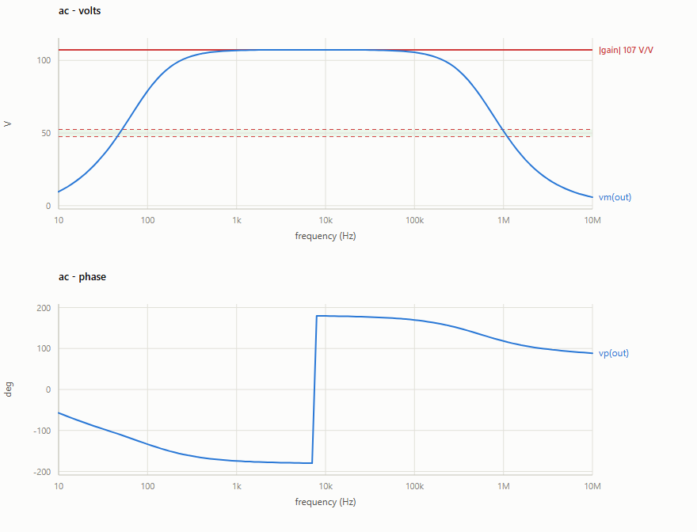
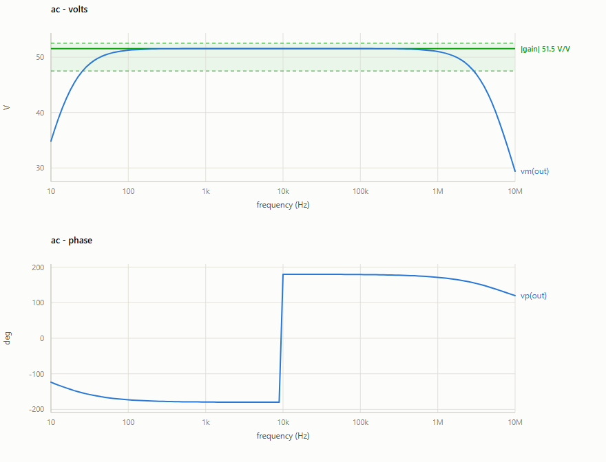
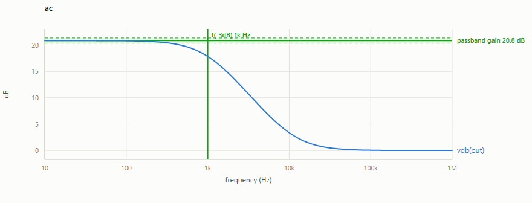
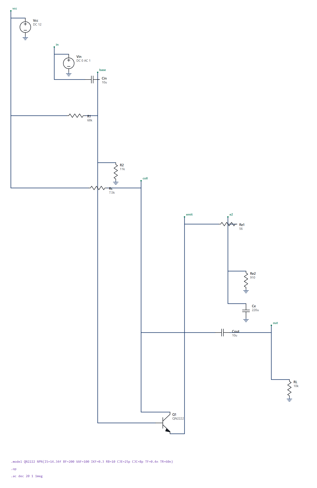

# spice-assistant

[](https://github.com/tankenbrandt/spice-assistant/actions/workflows/tests.yml)

**Natural language to a verified analog circuit.** Describe a circuit, get an
ngspice netlist that simulates, then check whether it is actually *correct* --
and whether it stays correct once the parts have tolerances, the supply sags
and the board runs from -40 to +85 C.

Three layers, because "it ran" is not "it works":

| Layer | Question | Cost |
|-------|----------|------|
| `main.py` | does the deck simulate at all? | one API call per repair |
| `speccheck.py` + `specs.py` | does it meet its electrical spec? | free (ngspice only) |
| `robustness.py` | how often does it meet it, across tolerance, supply and temperature? | free (ngspice only) |

On the 8-circuit benchmark those three questions get three very different
answers: **100% simulate cleanly, 62-75% meet spec**, and the worst offender
had a **1% Monte Carlo yield** before repair. Sim-success overstates real
capability by 25-38 points.

Those are four independent runs, not one. Generation is sampling, so a single
run is an anecdote: across 4 runs (`python repeat_summary.py`) every circuit
simulated cleanly **every time**, while the spec pass rate moved between 5 and
6 of 8. `buck_converter` and `ce_bjt_amp` fail their spec in *all four*; the
rectifiers are borderline and each fail once. The reproducible part is the
gap, not the second decimal place.

Every measurement is then cross-checked against a **second, independently
written simulator**: the same spec is re-measured in LTspice, headlessly, and
**9 of 10 circuits agree within 1%** — most to six significant figures. See
[Two simulators, one spec](#two-simulators-one-spec-crosscheckpy-ltspicepy).

<p align="center">
  
</p>

<p align="center">
  
</p>

*The failure a "did it run?" check cannot see: this deck simulates perfectly
and has more than twice its specified gain.*

<p align="center">
  
</p>

*After spec-in-the-loop repair, the same measurement inside the band.*

## The generate-and-repair CLI

A tiny CLI that turns a plain-English circuit description into a working
[ngspice](https://ngspice.sourceforge.io/) netlist. It asks Claude for a
netlist, runs it through `ngspice -b`, and if the simulation fails it feeds the
error back to the model for a correction — retrying up to 4 total attempts. At
the end it prints the final netlist **and** the full ngspice output so you can
see exactly what happened.

ngspice is called directly as a subprocess in batch mode. There is intentionally
no PySpice / InSpice / other binding — raw text in, raw text out.

## Requirements

- Python 3.10+
- ngspice on your `PATH` (or reachable via `NGSPICE_PATH`, or bundled under
  `tools/Spice64/bin`)
- An Anthropic API key **only for `spice-assistant` and the benchmark**. The
  spec, robustness, plotting and schematic tools are ngspice-only and cost
  nothing to run.

## Install

```powershell
# from the project root
py -m venv .venv
.\.venv\Scripts\Activate.ps1
pip install -e .
```

That installs the CLIs on your `PATH`:

| Command | Module | Does |
|---------|--------|------|
| `spice-assistant` | `main.py` | description -> netlist -> simulate -> self-heal |
| `spice-speccheck` | `speccheck.py` | measure a deck and judge it against a spec |
| `spice-robustness` | `robustness.py` | Monte Carlo, sensitivity, worst case, PVT |
| `spice-plot` | `plot.py` | waveforms with the acceptance band on them |
| `spice-netlist` | `netlist.py` | `.asc` schematic -> ngspice deck |
| `ascview` | `ascview.py` | render a `.asc` without LTspice |
| `spice-symlib` | `symlib.py` | inspect LTspice's own `.asy` symbol library |

Every example below also works as `python <module>.py ...` straight from a
clone, with no install. Only `spice-assistant` needs an API key; everything
else is ngspice only.

### ngspice

**Windows** (this repo was set up on Windows): the official ngspice binary is
bundled under `tools/Spice64/bin` (downloaded from SourceForge). `main.py` finds
it automatically, so nothing else is needed. To make `ngspice` available in your
own shells, add that folder to `PATH`:

```powershell
$bin = "$PWD\tools\Spice64\bin"
setx PATH "$env:PATH;$bin"   # new shells only; restart the terminal after
```

**macOS / Linux**: install via your package manager and it will be on `PATH`:

```bash
brew install ngspice      # macOS
sudo apt install ngspice  # Debian/Ubuntu
```

`main.py` resolves the executable in this order: `NGSPICE_PATH` env var →
`ngspice_con`/`ngspice` on `PATH` → the bundled `tools/Spice64/bin` copy.

### API key

```powershell
$env:ANTHROPIC_API_KEY = "sk-ant-..."   # current shell
# or persistently:
setx ANTHROPIC_API_KEY "sk-ant-..."     # new shells only
```

Or drop a `.env` file next to `main.py` — every entry point reads it, and a
real environment variable always wins over the file:

```
ANTHROPIC_API_KEY=sk-ant-...
```

## Usage

```powershell
python main.py "a first-order RC low-pass filter with a 1kHz cutoff frequency and a 5V DC source"
```

Progress lines (attempt N, success/failure) are written to stderr; the final
netlist and full ngspice output go to stdout. The process exits `0` on a
successful simulation, `1` if all attempts failed.

## How it works

`main.py` exposes three functions:

- `generate_netlist(description)` — one Anthropic call (`claude-sonnet-5`) that
  returns netlist-only text; stray ``` fences are stripped defensively.
- `run_ngspice(netlist_text)` — writes a temp `.cir`, runs `ngspice -b`, and
  returns `(success, combined_output)`. Because ngspice often exits `0` even on a
  bad deck, success also requires that the output contains no error signatures.
- `fix_netlist(netlist_text, error_output)` — sends the failing netlist plus the
  ngspice output back to the model and returns a corrected netlist.

## Specs for your own circuits (`specs_lib/`, `specs.py`)

The benchmark's spec checks are one hand-written Python function per circuit,
which is fine for a fixed test set and useless for your own amplifier. A
**declarative spec** describes a measurement instead of implementing it --
run an analysis, pull a quantity out of the resulting vectors, compare it to
a limit:

```yaml
circuit: rc_lowpass
analyses:
  ac: {command: ac dec 200 10 1meg, vectors: [vdb(out)]}
measurements:
  - name: f3db
    label: f(-3dB)
    units: Hz
    extract: {kind: crossing, of: vdb(out), level: first - 3, direction: falling}
    target: 1000
    tol: 5%
```

```powershell
python speccheck.py my_filter.cir --spec my_filter.yaml
python robustness.py my_filter.cir --spec my_filter.yaml --mc 500 --sens --worst
```

**One spec file drives both layers.** The measurements that produce the
nominal verdict are the same ones Monte Carlo, sensitivity and worst-case
perturb, so a circuit is described once and signed off end to end.

Extractors: `max`, `min`, `mean`, `peak_to_peak`, `crossing`, `value_at`,
`at_peak`. A `window: last 20%` restricts a transient to steady state, and
levels may reference the curve itself (`first - 3`, `max / sqrt(2)`).
Measurements can be `expr`-derived from earlier ones (`q: f0 / (f_hi - f_lo)`),
and intermediates that exist only to be referenced are marked
`informational: true` so they are measured and reported without deciding the
verdict. Expressions are evaluated through an AST whitelist, so a spec file
is data, not code.

The ten specs in `specs_lib/` cover the benchmark's circuits, and the test
suite asserts that each one reaches the same verdict *and the same measured
number* as the hand-written checker it replaces.

## Plotting what the spec measured (`plot.py`)

`speccheck` prints a number; `plot.py` draws the curve it came from, with the
acceptance band on it.

```powershell
python plot.py my_filter.cir --spec my_filter.yaml --open
python plot.py deck.cir --analysis "tran 10u 5m" --vectors "v(in)" "v(out)"
```



The HTML page carries a crosshair readout (every series at the pointer's
frequency), a legend, and a table of the specs, so the numbers stay reachable
without hovering. Vectors are grouped into panels **by unit**, so a Bode plot
is a magnitude panel stacked on a phase panel rather than one chart with two
y-scales: with two scales on one set of axes, wherever the curves cross is an
artefact of where the scales were pinned, not a fact about the circuit.

## Schematic to netlist (`netlist.py`)

Closes the loop: extract the connectivity from an `.asc` and emit a deck, so a
schematic drawn in LTspice can be simulated and verified here.

```powershell
python netlist.py schematic.asc -o deck.cir
python netlist.py schematic.asc --pinorder "OP07=in+,in-,v+,v-,out"
python netlist.py schematic.asc --strict     # fail rather than emit a TODO
```

Nets come from the drawing. Wire endpoints and symbol pins are merged with a
union-find, including T-junctions where a wire lands part-way along another,
and a net takes its name from any `FLAG` on it (`0` for ground); the rest
become `N001`, `N002`, ...

What it will not do is invent a pin order. Primitives have a fixed, verified
order. A library part's subcircuit pin order is a property of the library, not
the drawing, so by default it is emitted as a commented `X` line listing the
nets its pins landed on, and `--pinorder` is how you state the real one.

That T-junction rule earns its keep. The first version of the example
schematic looked right and passed `ascview --check` -- every pin sat on a
wire -- but the feedback wire ran straight *through* the non-inverting input
pin on its way down to `Rg`, shorting the two op-amp inputs. `--check` cannot
see that; extracting the netlist named both inputs the same net and made it
obvious.

## A worked example (`examples/`)

`examples/` holds one circuit in all four forms: schematic, netlist, spec, and
the plot above. The schematic is self-contained -- supplies and the op-amp
macromodel included -- so the deck extracted from it measures **identically**
to the hand-written one, which the test suite asserts.

```powershell
python ascview.py examples/active_lowpass.asc --open
python netlist.py examples/active_lowpass.asc --pinorder "OP07=in+,in-,v+,v-,out"
python speccheck.py examples/active_lowpass.cir --spec examples/active_lowpass.yaml
python robustness.py examples/active_lowpass.cir --spec examples/active_lowpass.yaml --mc 500 --sens
python plot.py examples/active_lowpass.cir --spec examples/active_lowpass.yaml --open
```

The sensitivity output doubles as a check that the layer measures physics
rather than noise. For `fc = 1 / (2*pi*Rf*C1)` it reports **-1.01 %/% for C1
and -1.02 %/% for Rf**, and for the gain it reports equal and opposite
sensitivities to `Rf` and `Rg`. Those are the textbook answers.

## Viewing LTspice schematics (`ascview.py`)

Opens LTspice `.asc` schematic files **without LTspice** and renders them to a
standalone SVG, an HTML page, or a PNG — for screenshotting into lab reports.

```powershell
python ascview.py "Sallen-Key Filter Sim.asc" --open     # render + open in browser
python ascview.py sch.asc --png                          # also write a PNG
python ascview.py sch.asc --format svg --theme dark
python ascview.py *.asc --check                          # validate symbol geometry
```

The `.asc` format stores explicit coordinates for every wire, symbol and label,
so rendering needs no placement or routing — it is a parse-and-draw problem.

- `--open` writes an HTML page and opens it in the default browser.
- `--png` rasterizes via headless Chrome/Edge, sized exactly to the drawing.
- `--check` reports, per symbol, how many of its pins land on a wire endpoint.

### Symbol geometry

The built-in symbol table is **validated against LTspice's own `lib/sym`**, and
the test suite re-checks it on every run (`tests/test_symlib.py`) rather than
resting on a measurement taken once. That check is what caught `nmos`/`pmos`
carrying the BJT's pin offsets, and `sw` being modelled with two pins when
LTspice's voltage-controlled switch has four.

Library parts (`OpAmps\\LTC2053`, vendor symbols) have per-part pin layouts
that cannot be guessed from the name. Two paths:

- **LTspice installed** — `symlib.py` reads the part's real `.asy`, so it is
  drawn from its true geometry and, because every pin carries a `SpiceOrder`,
  netlisted in its true node order. No configuration.
- **No LTspice** — the part is drawn as a labelled block whose pins are
  inferred from the schematic's own wiring, and `netlist.py` reports the pin
  order rather than inventing one. `--no-lib` forces this path.

Connectivity is never invented either way: wires are always drawn from their
own coordinates.

```powershell
python symlib.py                     # is a library installed, and how big
python symlib.py npn OpAmps/OP07     # pin coordinates and SpiceOrder
```

Set `LTSPICE_SYM_DIR` if your install is somewhere unusual.

LTspice can also netlist a schematic headlessly, so `netlist.py` is
**differentially tested against LTspice itself** — both netlisters run over
every shipped `.asc` and the connectivity is compared device by device, same
nets in the same node order. Node order is the whole game: `Q1 c b e` and
`Q1 e b c` are different circuits.

## Two simulators, one spec (`crosscheck.py`, `ltspice.py`)

Everything above measures with ngspice. That is one program's opinion. The same
spec can be asked of **LTspice** — a separately written, closed-source
simulator that most analog designers already have open — and the two compared:

```powershell
python crosscheck.py --all
python crosscheck.py repaired/ce_bjt_amp.cir --spec specs_lib/ce_bjt_amp.yaml
```

```
repaired\ce_bjt_amp.cir  (spec: ce_bjt_amp.yaml)
  ok   gain         ngspice=51.5266       ltspice=51.5265         0.000%
  ok   f_mid        ngspice=8912.51       ltspice=8912.51         0.000% (informational)
  ok   inversion    ngspice=179.999       ltspice=179.999         0.000%

9/10 circuits agree within 1.0% on every spec measurement
```

Two independently written simulators agreeing on a nonlinear BJT stage's gain
to six figures is a much stronger claim than either one alone. LTspice runs
headless (`-b -ascii -Run`, ~90 ms for a small AC sweep) so this is a test, not
a manual step — and the schematics in `examples/` still open in the LTspice GUI
normally, because a `.asc` file is just text.

The disagreements are the interesting part:

| Circuit | Measurement | ngspice | LTspice | |
|---|---|---|---|---|
| buck_converter | ripple | 8.51 mV | 11.03 mV | real: ripple depends on timestep control |
| ce_amp | `f_mid` | 1.26 MHz | 10 MHz | **not** a disagreement — see below |
| boost_converter | vout | 11.766 V | 11.832 V | 0.56%, within tolerance |

`f_mid` reads as an 87% gap and is not one. It is `argmax` over the gain curve,
and *both* simulators put the gain within 0.5% of its peak across the same 85
of 121 points — a flat plateau from 631 Hz to 10 MHz. The physics agrees; only
the tiebreak differs. It is marked `informational`, so it never fails a run.

Switching-converter ripple is the one genuine disagreement, and it is worth
knowing before quoting a ripple figure from either tool to three digits.

Getting this right required translating two things, and the second one bites
silently:

- **`.control` blocks.** LTspice has never understood one. Left in place it
  does not error — it runs the deck with *no analysis* and writes an empty raw
  file.
- **Analysis options.** A spec may re-drive a source between analyses
  (`alter @vinp[acmag]=0.5`). Dropping those lines left the differential pair's
  two inputs driven in phase, so its "differential" gain was really the
  common-mode gain — reported as a perfectly plausible 3.7e-05. An option with
  no LTspice equivalent now raises rather than being skipped.

## Deck to schematic (`ascgen.py`)

`netlist.py` goes schematic -> deck; `ascgen.py` goes back the other way, so a
generated deck can be opened and probed in the real LTspice GUI rather than
only read as text.

```powershell
python ascgen.py repaired/ce_bjt_amp.cir -o ce_bjt_amp.asc
python ascgen.py repaired/ce_bjt_amp.cir --check    # round-trip the result
```

<p align="center">
  
</p>

The layout is mechanical -- a column per net, a row per device -- and it does
not try to be draughtsmanship. What it guarantees is connectivity: `--check`
re-extracts the drawing and compares it device by device, and the tests
additionally round-trip it through **LTspice's own netlister**. Of the repo's
22 decks, **19 round-trip exactly** and 3 are refused up front (controlled
sources and subcircuit calls have no symbol to draw, so it says so rather than
mis-drawing them). LTspice simulating the generated schematic above measures
|gain| = 51.5265, against 51.5266 from the deck it was written from.

Three bugs the round trip caught that a rendered picture would not have:
routing a device's pins along one shared row shorted collector, base and
emitter together; a 48-unit ground lead landed exactly on the voltage-
controlled switch's neighbouring pin, quietly grounding its gate; and the
title line was parsed as a component, so `RC Low-Pass Filter, fc=1kHz` became
a resistor named `RC` -- which round-tripped happily, because both sides made
the same mistake.

## Where the tolerances come from (`tolerances.yaml`)

The robustness layer used to perturb every resistor by 5% and every capacitor
by 10%. Reasonable guesses, but guesses. `tolerances.yaml` replaces them with
figures read off manufacturer datasheets, each carrying its citation and how
far it was actually verified:

```powershell
python tolerances.py                      # the table
python tolerances.py --profile precision
python tolerances.py --gaps               # what could not be verified
python robustness.py deck.cir --circuit ce_bjt_amp --mc 300 --parts precision
```

`--parts` selects a whole bill of materials -- `commodity` (5% thick film,
10% X7R, 20% power inductor), `precision` (1% thin film, C0G), `worst_case`,
or `legacy` (this layer's original guesses, kept so the numbers already in
`ROBUSTNESS.md` stay reproducible).

Three things the sourced numbers changed:

- **Inductors were optimistic.** The layer assumed +-10%; commodity power
  inductors are **+-20%** (Coilcraft's whole XAL7070 family). `legacy` keeps
  the old value so published figures still regenerate.
- **The BJT beta spread was right.** +-50% about a nominal 200 reproduces the
  2N2222A's guaranteed 100..300 exactly. Worth knowing it was well founded
  rather than assuming so -- though an *ungraded* BC847 spans 110..800, 7.3:1,
  because A/B/C are the same die sorted into bins.
- **One number is not sourced at all.** No BJT datasheet publishes Early
  voltage; it exists only in third-party SPICE libraries. The layer perturbs
  `VAF` by 25% anyway, and `--gaps` now says so out loud.

A Class II ceramic's DC-bias loss is **deterministic, not random** -- Vishay
measured a 0603 100nF/50V part losing ~80% of its capacitance at a 20 V/um
field. Widening a random tolerance band to "cover" that is wrong twice: it
misses the systematic shift and invents variance that is not there. The table
records it as a separate C(V) term rather than folding it into a tolerance.

Monte Carlo samples are **not** snapped to E-series values, which matches
LTspice's own `mc()`, PSpice and every practitioner source found. The E-series
constrains which *nominal* a designer may choose; it says nothing about how one
manufactured part varies around it.

### What better parts actually buy

On the repaired common-emitter amp, going from commodity to precision passives
tightens sigma by 23% (1.565 -> 1.21 V/V) and moves yield by **one point**,
67% to 68%. That is the useful answer, and it is not the obvious one: the mean
gain sits at 51.74 against an upper spec limit of 52.5, so Cpk is 0.162 and the
design is limited by **centring, not spread**. Re-centring is worth more here
than any amount of money spent on 1% resistors.

## Layout

```
main.py  speccheck.py  specs.py  robustness.py      the layers
plot.py  ascview.py    netlist.py    symlib.py      viewing and extraction
ltspice.py  crosscheck.py                           the second simulator
ascgen.py                                            deck -> .asc schematic
tolerances.py  tolerances.yaml                       sourced part tolerances
benchmark.py  robustness_study.py                   the study drivers
repeat_summary.py                                    spread across repeat runs
specs_lib/       declarative specs for the benchmark circuits
examples/        one circuit as schematic, netlist, spec and plot
baseline/        the decks the model generated, as generated
repaired/        the same decks after spec-in-the-loop repair
logs/            full per-attempt evidence behind REPORT.md / ROBUSTNESS.md
logs/repeats/    summary.json: the 4-run spread (raw runs gitignored, ~20 MB)
docs/            per-round analysis prose and the README images
tests/           521 tests, no API calls
```

`REPORT.md` and `ROBUSTNESS.md` are generated from `logs/`, and regenerate
byte-identically:

```powershell
python benchmark.py --report-only
python robustness_study.py --report-only
```

## Known limitations

- The spec and robustness layers are **nominal-topology tools**: they perturb
  component values, supplies, model parameters and temperature. They know
  nothing about layout parasitics, EMC, or anything the netlist does not say.
- `extract_params` descends into `.subckt` definitions, so a macromodel's
  internal components are perturbed like discrete parts. For an op-amp
  macromodel that is a rough stand-in for gain-bandwidth spread rather than a
  datasheet figure, so read those sensitivities as directional.
- Specs whose **target is computed from the netlist** (the `rl_step` circuit's
  tau = L/R) are not expressible declaratively yet; a spec target is a
  constant. The hand-written check still covers that circuit.
- `ARC` primitives from `.asy` files are approximated as circular arcs
  through their endpoints, so a few vendor symbols draw slightly differently
  from LTspice. Pin positions, and therefore connectivity, are exact.
- ngspice accepts some malformed decks (a component with no value) and reports
  a clean run. That gap is the reason the spec layer exists.
- **The benchmark is small and hand-written.** Fifteen textbook analog
  circuits of 5-15 components (`benchmark.py`), chosen by the author. They
  represent coursework and bench work, not an IC or a supply with real
  compensation, and the selection is not independent of the tool. The headline
  worth quoting is therefore not the absolute 62% but the *gap* between "100%
  simulate" and "62% meet spec" — that gap is what survives the benchmark
  being small.
- A cross-simulator agreement is evidence that a measurement is a property of
  the circuit rather than of ngspice. It is not evidence that either simulator
  matches hardware; both share modelling assumptions the bench does not.

## Tests

```powershell
pip install -r requirements-dev.txt
pytest
```

The suite makes **no API calls** — it covers the netlist helpers, the spec
extractors, the robustness statistics and the `.asc` parser and symbol
geometry, using ngspice alone. That includes the project's central claim as an
executable contract: every baseline deck simulates cleanly, the ones the spec
layer rejects are exactly the ones the repaired decks fix, and the repair moves
the Monte Carlo *distribution* onto target rather than just the nominal value.

Tests that need ngspice skip themselves if it is not installed, so the parser
and geometry tests still run anywhere.

## License

MIT — see [LICENSE](LICENSE).
